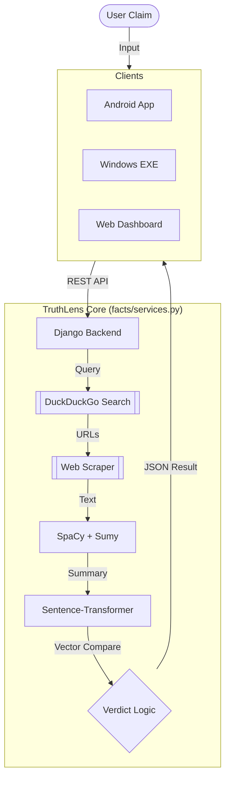

# TruthLens 🔍
> **Advanced Real-Time Fake News Detection & Verification System**


**TruthLens** (formerly *News Guardian*) is a robust cross-platform application designed to combat misinformation. Unlike static fact-checking databases, TruthLens leverages **Web Scraping**, **Natural Language Processing (NLP)**, and **Machine Learning** to verify claims in *real-time* by cross-referencing them against the live internet.

---

## 📥 Downloads

Get the latest version of TruthLens for your device:

| Platform | Type | Download Link | Status |
| :--- | :---: | :--- | :--- |
| **Android** | `.apk` | [**Download APK**](https://github.com/sakshamwadhankar/-EV55_Desync/releases) | ✅ Active |
| **Windows** | `.exe` | [**Download Installer**](https://github.com/sakshamwadhankar/-EV55_Desync/releases) | ✅ Active |
| **Web App** | `Link` | [**Visit Website**](https://true-lens.netlify.app/) | 🌐 Live |

---

## 🧠 AI Model & Training

The core intelligence of TruthLens is powered by a custom-tuned pipeline using **Sentence-Transformers**.

*   **Training Notebook**: [📄 View Model Training Code (newsguardian_1_0_0.ipynb)](./newsguardian_1_0_0.ipynb)
*   **Model Architecture**: `all-MiniLM-L6-v2` (384-dimensional embeddings).
*   **Performance**: Optimized for low-latency inference on CPU (Run-time < 200ms).

---

## 🚀 Key Features

*   **Real-Time Verification**: Instantly verifies claims by querying the live web (DuckDuckGo).
*   **Intelligent Scraping**: Extracts content from diverse news sources, handling anti-bot measures.
*   **Semantic Analysis**: Uses `Cosine Similarity` on SBERT embeddings to determine if sources *actually* support the claim.
*   **Cross-Platform**:
    *   📱 **Android App**: Native Java/XML implementation.
    *   💻 **Desktop App**: Electron/Node.js application for Windows.
    *   🌐 **Web Dashboard**: Responsive Django web interface.

---

## 🏗️ System Architecture

TruthLens follows a clean **Service-Oriented Architecture** within Django.



---

## 🛠️ Technology Stack

| Component | Technology |
| :--- | :--- |
| **Backend** | Django (Python), Gunicorn |
| **AI / NLP** | `sentence-transformers`, `spaCy`, `sumy`, `nltk` |
| **Search** | `duckduckgo-search`, `googlesearch-python` |
| **Desktop App** | Electron.js, Node.js |
| **Android App** | Java, XML, Retrofit |
| **Deployment** | Docker, Koyeb, Railway, Netlify |

---

## 📝 How it Works (The "Verify" Pipeline)

1.  **Search Strategy**: The system generates multiple search queries (Exact match, Entity-based, Keyword-augmented) to find the best articles.
2.  **Scraping & Cleaning**: Relevant content is scraped, stripping away ads and boilerplate text.
3.  **Summarization (LSA)**: `Sumy` reduces long articles to their top 10 most semantically significant sentences.
4.  **Vector Embedding**: The User's Claim and the Article Summaries are converted into high-dimensional vectors.
5.  **Similarity Check**: We calculate the **Cosine Similarity** score.
    *   **> 0.45**: Strong Evidence (TRUE)
    *   **< 0.15**: No Relation
    *   **Contradiction**: High topic match but low claim match.

---

## 💻 Installation (Developers)

### Prerequisites
*   Python 3.10+
*   Git

### Quick Start
```bash
# 1. Clone Repo
git clone https://github.com/sakshamwadhankar/-EV55_Desync.git
cd -EV55_Desync

# 2. Install Deps
pip install -r requirements.txt
python -m spacy download en_core_web_sm

# 3. Run Server
python manage.py migrate
python manage.py runserver
```

---

## 📄 License

This project is open-source and available under the **MIT License**.
