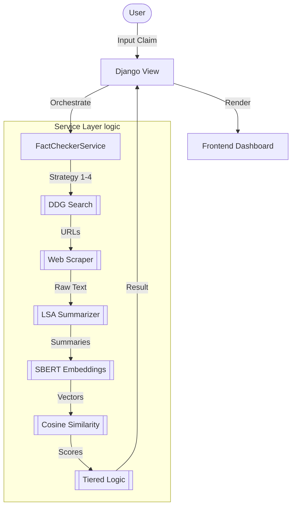

# TruthLens: Technical Documentation & Project Overview

## 1. Introduction
**TruthLens** (formerly *News Guardian*) is an advanced, real-time fake news detection and verification system. Unlike static databases of known fake news, TruthLens actively verifies claims by cross-referencing them against the "live" internet. It combines modern Web Scraping, Natural Language Processing (NLP), and Deep Learning to provide users with a reasoned verdict on any news headline or claim.

---

## 2. Core Purpose
The primary goal of TruthLens is to combat digital misinformation by providing an automated way to verify claims. It addresses several key challenges:
- **Real-time verification**: News breaks faster than fact-checkers can document. TruthLens searches the live web for the latest info.
- **Contextual Analysis**: It doesn't just look for keywords; it understands the semantic meaning of articles to see if they actually support or refute a claim.
- **Automation of Fact-Checking**: It automates the tedious process of searching, reading multiple articles, and summarizing evidence.

---

## 3. Technology Stack

### Backend
- **Framework**: Django 4.1+ (Python 3.10+)
- **Architecture**: Service-Oriented (Logic isolated in `facts/services.py`).
- **Models**: `spacy` (en_core_web_sm), `sentence-transformers` (all-MiniLM-L6-v2).

### Frontend
- **Design**: Vanilla HTML5, Bootstrap 5, Custom CSS.
- **Assets**: WordCloud (dynamic PNG generation), Matplotlib.

### Intelligence & Data
- **Search Engine**: DuckDuckGo (via `duckduckgo-search`).
- **Scraping**: `requests`, `BeautifulSoup4`.
- **NLP Core**: `sumy` (LSA Summarizer), `Sentence-Transformers`.

---

## 4. System Architecture
TruthLens follows a clean implementation of the **Service Layer** pattern within Django's MVT structure.



---

## 5. The Verification Pipeline (Deep Dive)

### A. Intelligent Search Strategy
The system doesn't give up if the first search fails. It uses four fallback strategies:
1. **Direct Query**: Searches the exact user string.
2. **Simplified Query**: Removes punctuation and special characters.
3. **Keyword Augmentation**: Appends "news fact check" to the query.
4. **Entity Extraction**: Uses SpaCy to extract Proper Nouns and Verbs to form a high-signal search query.

### B. Robust Scraping & Cleaning
- **Selective Extraction**: Specifically targets `<p>`, `<h1>`, `<h2>`, and `<article>` tags to avoid sidebar/footer noise.
- **Filtering**: Discards snippets shorter than 30 characters.
- **Timeout Management**: 5-second hard timeout per URL to prevent the entire pipeline from hanging on slow sites.

### C. Semantic Summarization
Instead of analyzing massive amounts of text, TruthLens uses **Latent Semantic Analysis (LSA)** via the `sumy` library. It condenses articles into the top 10 most "conceptually significant" sentences. This provides a clean input for the embedding model.

### D. The Similarity Engine (SBERT)
The system uses the `all-MiniLM-L6-v2` model from `sentence-transformers`. 
- **Embeddings**: Converts both the User Claim and the Article Summaries into 384-dimensional vectors.
- **Math**: Calculates the **Cosine Similarity** between the claim's vector and each article's vector.
- **Advantage**: It understands that *"India wins the cup"* and *"The Indian team emerged victorious in the final"* are semantically identical, even with different wording.

### E. 5-Tier Verdict Logic
Verdicts are not just "True" or "False". The system uses a nuanced thresholding system:
1. **Strong True**: High maximum similarity (>0.45) across sources.
2. **Likely True**: Solid average similarity (>0.25) across multiple articles.
3. **Unverified**: Moderate signal, but nothing conclusive.
4. **Strong Fake**: Found many sources (3+) but *none* of them match the claim (Negative Confirmation).
5. **Insufficient Data**: No relevant sources found on the web.

---

## 6. Project Structure

- `news_guardian/`: Core configuration, settings (renamed from `kavach`).
- `facts/`: The main application logic.
    - `services.py`: The "Brain" of the project (Scraping/AI logic).
    - `views.py`: Controls data flow between the service and UI.
- `TruthLensAndroid/`: A native Android implementation for mobile verification. It communicates with the Django backend via REST API calls. Key configuration involves setting the `BASE_URL` in `MainActivity.java` to point to the deployed backend.
- `research_prototypes/`: Standalone scripts for testing scrapers and models without running the full server. Examples include `debug_scraper.py` which allows developers to test search/scrape logic in isolation.
- `static/`: Global CSS and generated WordCloud images.

---

## 7. Prototype & Research
The `research_prototypes` directory contains isolated scripts used during the development phase to tune thresholds:
- **`debug_scraper.py`**: A CLI tool to test DuckDuckGo search strings and see raw scraped output.
- **Experimental Models**: Documentation of previous attempts with `RoBERTa-large` and why the switch to `MiniLM` was made (latency vs. accuracy).

---

## 8. Performance Optimizations
- **Singleton Model Loading**: Models are loaded once at startup into memory, preventing the heavy cost of reloading them with every request.
- **Model Quantization**: Uses a 1:15 ratio smaller model (`MiniLM`) compared to `RoBERTa-large` for production deployment while maintaining high accuracy.
- **Batch Processing**: SBERT embeddings for multiple articles are calculated in a single matrix operation for speed.

---

## 8. Development & Installation

### Prerequisites
- Python 3.10+
- `pip install -r requirements.txt`
- `python -m spacy download en_core_web_sm`

### Running Locally
```bash
python manage.py migrate
python manage.py runserver
```

---

## 9. Deployment & Containers
TruthLens is container-ready for production environments:
- **Docker**: A `Dockerfile` is provided for containerizing the Django backend. This handles the installation of heavy dependencies (SBERT, Spacy) and the downloading of NLP models during the build stage.
- **Netlify**: The `netlify.toml` file suggests support for deploying the frontend separately if needed, though the core app is a monolithic Django setup.

---

## 10. Data & Training
While the current version uses pre-trained SBERT models for real-time verification, the project includes a `dataset/` directory:
- **Source**: ISOT Fake News Dataset / GossipCop.
- **Usage**: Used during the research phase to validate the similarity thresholds (0.38 - 0.45) used in the `FactCheckerService`.

---

## 11. Future Roadmap
- **LLM Integration**: Replacing LSA with models like Llama-3 for more conversational reasoning.
- **Audio/Video Fact-Checking**: Integrating Whisper for transcribing and checking video news.
- **Source Reliability Index**: Weighing similarity scores based on the domain's reputation (e.g., BBC vs Unknown Blog).

---

> [!NOTE]
> This project was developed as a robust response to the "Infodemic". It prioritizes **Negative Confirmation** for "Fake" labels, meaning it only calls something fake if it finds evidence *of the topic* but *zero similarity* to the specific claim.
